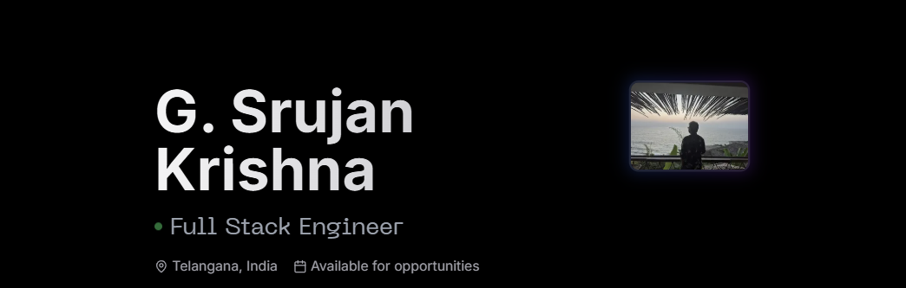

# Space

  

<h3 align="center">Space</h3>

  

    My Portfolio 
     
     
    <a href="mailto:srujankrishnac1@gmail.com">Contact Me</a>
  

  
Table of Contents

  <ol>
    <li>
      <a href="#about-the-project">About The Project</a>
      <ul>
        <li><a href="#built-with">Built With</a></li>
      </ul>
    </li>
    <li><a href="#license">License</a></li>
  </ol>

## About The Project

Welcome, this is my personal portfolio, featuring my projects, skills, and a bit about me. It's designed to provide an overview of my work and who I am.

### Built With

- 
- 
- 
- 
- 
- 

## License

Distributed under the MIT License. See `LICENSE` for more information.

---

**Gandamalla Srujan Krishna**  
[GitHub](https://github.com/srujankrishnaa)  
[LinkedIn](https://www.linkedin.com/in/srujan-krishna-944a03257/)  
Email: srujankrishnac1@gmail.com
